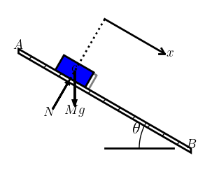

In summer 2020 I discovered [Pysketcher](https://github.com/hplgit/pysketcher) as I was looking for a way to create Physics sketches for both design and simulation.

My second requirement is to have sketches available in Jupyter notebooks (Lab or notebook server)

Pysketch was developped in 2012 by [Hans Petter Langtangen](https://en.wikipedia.org/wiki/Hans_Petter_Langtangen), see it in [GitHub](https://github.com/hplgit/pysketcher). At that time, Jupyter was emerging and Pysketch was developped as a standalone application. 

I just need to upgrade it to make it compatible with Jupyter: This is the inception of Jupyter Sketch project!

A sketch capturing the "dry friction case"

How it is structured: the composition hierarchy

