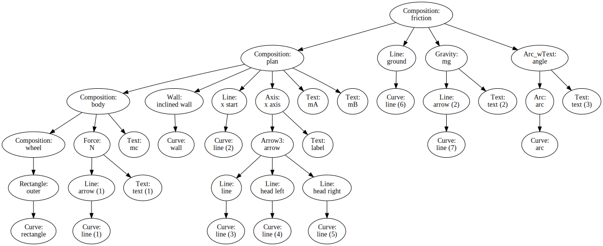

# Welcome to Jupyter Sketcher User Guide

 **Home Page of jupytersketcher project**

Any time you need to make a sketch while solving a mechanical problem with a jupyter notebook, then PySketcher is your friend!

A sketch capturing the "dry friction case"

How it is structured: the composition hierarchy

