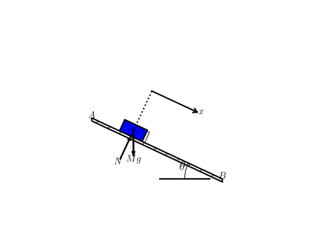
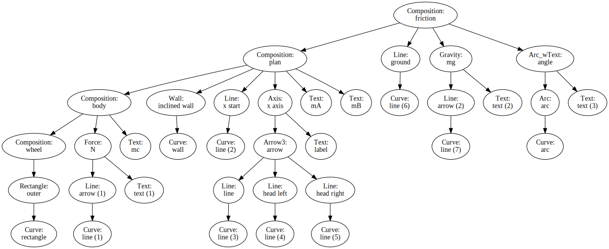

## A language to describe a sketch

Pysketcher initial version [HPL Pysketcher]() enable sketch definition in python. HPL is showing the hierachical nature of sketches. This is implemented via the Composition function. One can further grasp this using the graphviz_dot function applied to discover the composition herarchy implemented as a graphviz image [see The hierarchy of the "friction" sketch](#friction-sketch-hierarchy) at the end of this page.

Due to the hierarchical nature of sketches, it is quite straightforward to think about using yaml as the syntax for defining a sketch.

Benefits are the following:

* Leaner sketch writing as only data relevant to the context needs to be defined
* A more straightforward reading for the same reason
* A more robust sketch definition 
    * The same set of rules is applied to generate a sketch
    * No further python idiom is be intermingled as opposed to the case of python defined sketches
    * Don't make me wrong! Data defined versus program defined there is no winner, it's just a matter of context

## Example

This example provides the yaml content to define the Dry Friction case

### The final sketch


An inclined plan (the A-B edge) supports a blue rectangle which is dragged down by gravity. The plan makes an angle $\theta$ with the ground level. Sketch implementation notebook includes a controller enabling the $\theta$ angle to change. The whole plan, including the body, can rotate arround point B.

### Support files

The example we are developing now is based upon the "Dry Friction mockup" notebook

* the rendered html version of the notbook can be viewed [here](resources/DryFriction.html)
* the notebook can be download [here](resources/DryFriction.ipynb)

### The yaml definition

Sketcher language is defined as a yaml compliant file or string. The yaml file is a dictionnary of "objects". Objects can be regular python objects or sketcher objects.
A skertcher object is composed as follow:

* **a formula**: it's a leaf object, like Rectangle, Circle, Line etc or a composition
* **a style list**: line or fill colors, line stroke... declared as a yaml hierarchy
* **a transformation list**: the defined object can be transformed using sketcher transformation: translation, rotation...

As a general rule, a new object suppose all parameters to be defined before they are used to construct it.

**For example, you can create a circle if the center and the radius have been defined earlier in the file.**

The general layout of a sketcher file is as follow:

* **Libraries, Construction Variables, Frame**
    * declaration of the libraries used by the objects further declared: at least pysketcher is mandatory
    * various global variable which encompass the "Construction" variables which define the object main physical dimensions, positions...
    * some "actions" corresponding to executable python sentences
        * One mandatory action is the setting of the drawing frame (drawing_tool.set_coordinate_system): it must be declared before any other pysketcher object is used.
        * Other use case of action is the setting of global parameters like default line color: (drawing_tool.set_linecolor('black')) for example
    * this is stored in the head string thereafter
    * The example uses the following objects
        * libraries: setting the libraries used for this sketch
        * constants: all the sketch dimensionning data
        * frame: all the shapes or geometric objects which will be used by the other shapes
* **Sketcher Objects**
    * Usually starting with the declaration of Pysketcher leaf objects (Geometry object like Line, Circle, Rectangle...)
    * May be aggregated using the composition object
    * Composition can be made of composition object (recursive behaviour)
    * Grouping leafs and composition will be further used to apply transformation latter on (based on the "physics")
    * The example uese three group of shapes
        * The body object
        * The plan object
        * The friction main object
    * The plan includes the body
    * The friction includes the plan (that will be able to rotate as a group) and the ground (will stay fixed)

#### Libraries
```python
libraries = {'name': "head",
'shapes':"""\
libraries: ["from math import tan, radians, sin, cos","from pysketcher import *"]"""}
```
#### Constants: Construction parameters
```python
constants = {'name': "constants",
'shapes':"""\
fontsize: 18         # size of the characters
g: 9.81              # constant gravity
theta: 30.0          # inclined plane angle
L: 10.0              # sketch sizing parameter
a: 1.0               #
xmin: 0.0            # sketech min Abscissa
ymin: -3.0           # sketech min Ordinate     
rl: 2.0              # rectangle width
rL: 1.0              # rectangle length
"""}
```
#### Frame: core geometric parameters
```python
frame = {'name': "frame",
'shapes':"""\
setframe:            # sketch setup
    action: "drawing_tool.set_coordinate_system(xmin=xmin-L/5, xmax=xmin+1.5*L,ymin=ymin, ymax=ymin+1.5*L,instruction_file='tmp_mpl_friction.py')"
setblackline:        # default frame values and actions
    action: "drawing_tool.set_linecolor('black')"
B: point(a+L,0)                      # wall right end
A: point(a,tan(radians(theta))*L)    # wall left end
normal_vec: point(sin(radians(theta)),cos(radians(theta)))     # Vector normal to wall
tangent_vec: point(cos(radians(theta)),-sin(radians(theta)))   # Vector tangent to wall
help_line: Line(A,B)                 # wall line
x: a + 3*L/10.                       # contact point Abscissa
y: help_line(x=x)                    # contact point Ordinate
contact: point(x, y)                 # contact point: middle of the rectangle bottom edge
c: contact + rL/2*normal_vec
"""}
```
#### The body object
```python
body={'name': "body",
'shapes':"""\
rectangle: 
    formula: Rectangle(contact, rl, rL)
    style:
        linecolor: blue
        filled_curves: blue
    transform: ["rotate(-theta, contact)",
                "translate(-rl/2*tangent_vec)"]
N: 
    formula: Force(contact - rl*normal_vec, contact, r'$N$', text_pos='start')
    style:
        linecolor: black
wheel: 
    formula: "Composition({'outer': rectangle})"   
    style:
        shadow: 1
mc:
    formula: Text(r'$c$', c)
body: 
    formula: "Composition({'wheel': wheel, 'N': N, 'mc': mc})"
    style:
        linecolor: black
"""}
```
#### The plan object
```python
plan={'name': "plan",
'shapes':"""\
mB:
    formula: Text(r'$B$',B)
mA:
    formula: Text(r'$A$', A)
wall: 
    formula: Wall(x=[A[0], B[0]], y=[A[1], B[1]], thickness=-0.25,transparent=False)
    style:
        linecolor: black    
x_const: 
    formula: Line(contact, contact + point(0,4))
    style:
        linestyle: dotted
    transform: rotate(-theta, contact)
x_axis: 
    formula: "Axis(start=contact+ 2*rl*normal_vec, length=2*rl,label='$x$', rotation_angle=-theta)"
plan: 
    formula: "Composition({'body': body, 'inclined wall': wall, 'x start': x_const, 'x axis': x_axis, 'mA': mA, 'mB': mB})"
"""}
```
#### The friction sketch
```python
friction={'name': "friction",
'shapes':"""\
mg: 
    formula: Gravity(c, rl, text='$Mg$')
    style:
        linecolor: black
angle: 
    formula: "Arc_wText(r'$<bslash>theta$', center=B, radius=3, start_angle=180-theta, arc_angle=theta, fontsize=fontsize)"
    style:
        linecolor: black
        linewidth: 1
ground: 
     formula: Line((B[0]-L/10., 0), (B[0]-L/2.,0))
     stlye:
         linecolor: black
         linestyle: dashed
         linewidth: 1
friction: 
    formula: "Composition({'plan': plan, 'ground': ground, 'mg': mg, 'angle': angle})"
"""}
```

### Using the parser

To parse the above example, the following code do the job.

1. libraries, constants and frame must be used first as all the other bits needs one or more variable they defines.
2. After, any other sketch can be parsed, the order just need to respect precedence (if one object uses another it must be parsed after)
3. this setting allows naturally a modular definition of sketch objects

The parser checks for syntax precedence and warns of any detected error.

```python
myfig = {}
if sketchParse(libraries,myfig):
    if sketchParse(constants,myfig):
        if sketchParse(frame,myfig):
            if sketchParse(body,myfig):
                if sketchParse(plan,myfig):
                    if sketchParse(friction,myfig):
                        print("success")
```

### "friction" sketch hierarchy


