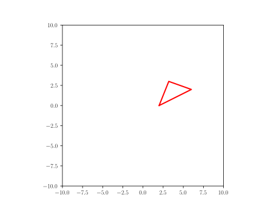
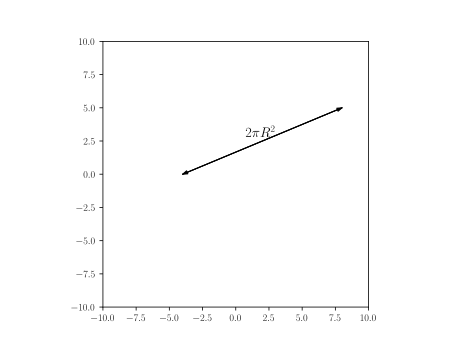
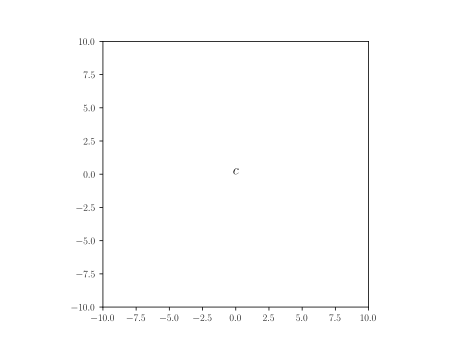
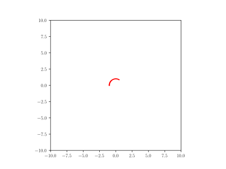

## List of Shapes

[Code to display shapes](#code-to-display-the-above-defined-shapes)

- [Line](#line): defines a line providing start and end point
- [Rectangle](#rectangle): defines a rectangle providing bottom left corner, x dimension, y dimension
- [Triangle](#triangle): defines a triangle providing three corner
- [Circle](#circle): defines a circle proving center and radius
- [Distance with text](#distance-with-text): defines a sizing mark with a label 
- [Text](#text): defines a given text positionned at the provided point
- [Cross](#cross): defines a cross positionned at the provided point
- [Axis](#axis): defines an axis at the given point with a given label
- [Arc](#arc): defines an Arc providing a center point, a radius, a starting angle and an angle (rotates clock-wise)
- [Arc_wText](#arc_wtext): defines an arc with text positionned left (moving clock-wise) of arc half-way
- [Arrow1](#arrow1): defines a line with arrow(s) given starting and ending point and arrow termination(s) ->, \<->, \<-
- [Force](#force): defines an Indication of a force by an arrow and a text (symbol)
- [Wall](#wall): defines an hached box given starting, ending point and thickness, filled with a pattern
- [](#)

## Line
[home](#list-of-shapes) Defines a line providing start and end point
### Yaml
```yaml
A: point(-5,-5)
B: point(5,5)
line: Line(A,B)
```
### Python
```python
A = point(-5,-5)
B = point(5,5)
line = Line(A,B)
```

## Rectangle
[home](#list-of-shapes) Defines a rectangle providing bottom left corner, x dimension, y dimension
### Yaml
```yaml
L: 8
h: 5
p: point(-(L/2),-(h/2))
rectangle: Rectangle(p,L,h)
```
### Python
```python
L = 8
h = 5
p = point(-(L/2),-(h/2))
rectangle = Rectangle(p,L,h)
```

## Circle
[home](#list-of-shapes) Defines a circle proving center and radius
### Yaml
```yaml
circle: Circle(point(0,0),5)
```
### Python
```python
circle = Circle(point(0,0),5)
```

## Triangle
[home](#list-of-shapes) Defines a triangle providing three corner
### Yaml
```yaml
L: 3.0
W: 4.0
triangle: Triangle(p1=(W/2,0), p2=(3*W/2,W/2), p3=(4*W/5.,L))
```
### Python
```python
L = 3.0
W = 4.0
triangle = Triangle(p1=(W/2,0), p2=(3*W/2,W/2), p3=(4*W/5.,L))
```

## Distance with text
[home](#list-of-shapes) Defines a sizing mark with a label 
### Yaml
```yaml
fontsize: 14
t: r'$ 2\pi R^2 $'  # sample text
dwt: Distance_wText((-4,0), (8, 5), t, fontsize)
```
### Python
```python
fontsize=14
t = r'$ 2\pi R^2 $'  # sample text
dwt = Distance_wText((-4,0), (8, 5), t, fontsize)
```

## Text
[home](#list-of-shapes) Defines a given text positionned at the provided point
### Yaml
```yaml
text: Text(r'$c$', point(0,0))
```
### Python
```python
text = Text(r'$c$', point(0,0))
```

## Cross
[home](#list-of-shapes) Defines a cross positionned at the provided point
### Yaml
```yaml
cross: Cross(point(0,0))
```
### Python
```python
cross = Cross(point(1,0))
```


## Axis
[home](#list-of-shapes) Defines an axis at the given point with a given label
### Yaml
```yaml
axis: Axis((0,0), 5, 'x', rotation_angle=0)
```
### Python
```python
axis = Axis((0,0), 5, 'x', rotation_angle=0)
```


## Arc
[home](#list-of-shapes) Defines an Arc providing a center point, a radius, a starting angle and an angle (rotates clock-wise)
### Yaml
```yaml
center: point(0,0)
radius: 1
angle: 120
start_angle: 180-angle
arc_angle: angle
arc: Arc(center, radius, start_angle, arc_angle)
```
### Python
```python
center = point(0,0)
radius = 1
angle = 120
start_angle = 180-angle
arc_angle = angle
arc = Arc(center, radius, start_angle, arc_angle)
```


## Arc_wText
[home](#list-of-shapes) Defines an arc with text positionned left (moving clock-wise) of arc half-way
### Yaml
```yaml
center: point(0,0)
radius: 1
angle: 120
start_angle: 180-angle
arc_angle: angle
arc_wtxt: "Arc_wText(r'$<bslash>theta$', center, radius, start_angle, arc_angle)"
```
### Python
```python
center = point(0,0)
radius = 1
angle = 120
start_angle = 180-angle
arc_angle = angle
arc_wtxt = Arc_wText(r'$\theta$', center, radius, start_angle, arc_angle)
```


## Arrow1
[home](#list-of-shapes) defines a line with arrow(s) given starting and ending point and arrow termination(s) ->, \<->, \<-
### Yaml
```yaml
start: point(0,0)
end: point(5,5)
arrow1: Arrow1(start, end, style='<->')
```
### Python
```python
start = point(0,0)
end = point(5,5)
arrow1 = Arrow1(start, end, style='<->')
```


## Force
[home](#list-of-shapes) defines an Indication of a force by an arrow and a text (symbol)

### Yaml
```yaml
x: 0
y: 0
contact: point(x, y)
vector: point(-3,-5)
force: Force(contact - vector, contact, r'$Force$', text_pos='start')
```
### Python
```python
x = 0
y = 0
contact = point(x, y)
vector = point(-3,-5)
force = Force(contact - vector, contact, r'$Force$', text_pos='start')
```


## Wall
[home](#list-of-shapes) defines an hached box given starting, ending point and thickness, filled with a pattern

### Yaml
```yaml
theta: 30
L: 8
B: point(L-4,-2)                      # wall right end
A: point(-4,tan(radians(theta))*L-2)  # wall left end
wall: 
    formula: Wall(x=[A[0], B[0]], y=[A[1], B[1]], thickness=-0.5,transparent=False)
    style:
        linecolor: black
```
### Python
```python
theta = 30
L = 8
B = point(L-4,-2)                      # wall right end
A = point(-4,tan(radians(theta))*L-2)  # wall left end
wall= Wall(x=[A[0], B[0]], y=[A[1], B[1]], thickness=-0.5,transparent=False)
wall.set_linecolor('black')
```


## Code to display the above defined shapes

[home](#list-of-shapes) In order to display the various shapes, use the following code in a jupyter notebook


```python
[1]: %matplotlib widget
[2]: from pysketcher import *
[3]: from math import tan, radians, sin, cos # needed for python code
[4]: drawing_tool.set_coordinate_system(xmin=-10, xmax=10,ymin=-10, ymax=10,axis=True)
[5]: drawing_tool.mpl.gcf().canvas
```
for Yaml, you need to add those extra steps

```python
head = """\
libraries: ["from math import tan, radians, sin, cos","from pysketcher import *"]
myfig={}
sketchParse(head,myfig)
```
The above code initialize myfig sketch space loading into it libraries references so samples can use tan, radians, si, cos and all the objects defined in pysketcher (the module name of jupytersketcher): this is used by the yaml definition of shapes

### Yaml

```python
myfig={}
sketch="""
# put here the yaml 'object' definition
"""
drawing_tool.erase()
sketchParse(sketch,myfig)
# replace 'object' by the actual one
d = myfig['object'].draw() 
drawing_tool.display()
```

### Python

```python
drawing_tool.erase()
# put the code of the object case here
# replace object by the actual name line, rectangle, circle...
object.draw()
drawing_tool.display()
```