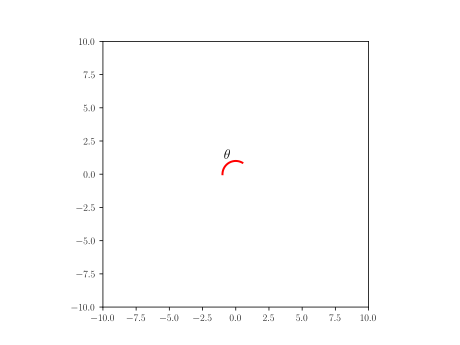
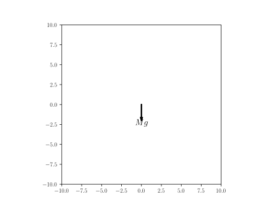

## List of Shapes

[Code to display shapes](#code-to-display-the-above-defined-shapes)

- [Line](#line): defines a line providing start and end point
- [Rectangle](#rectangle): defines a rectangle providing bottom left corner, x dimension, y dimension
- [Triangle](#triangle): defines a triangle providing three corner
- [Circle](#circle): defines a circle proving center and radius
- [Distance with text](#distance-with-text): defines a sizing mark with a label 
- [Text](#text): defines a given text positionned at the provided point
- [Cross](#cross): defines a cross positionned at the provided point
- [Axis](#axis): defines an axis at the given point with a given label
- [Arc](#arc): defines an Arc providing a center point, a radius, a starting angle and an angle (rotates clock-wise)
- [Arc_wText](#arc_wtext): defines an arc with text positionned left (moving clock-wise) of arc half-way
- [Arrow1](#arrow1): defines a line with arrow(s) given starting and ending point and arrow termination(s) ->, \<->, \<-
- [Force](#force): defines an Indication of a force by an arrow and a text (symbol)
- [Wall](#wall): defines an hached box given starting, ending point and thickness, filled with a pattern
- [Curve](#curve): defines a general curve as a sequence of (x,y) coordinates
- [Trajectory](#trajectory): defines a general curve as a sequence of Point (subclass Curve)
- [Gravity](#gravity): defines a downward-pointing gravity arrow with the symbol g or user given symbol.
- [Moment](#moment): defines a Moment arrow with text given text, center and radius
- [Text_wArrow](#text_warrow): defines Text, but an arrow is drawn from the mid part of the text to some point arrow_tip
- [Wheel](#wheel): defines Hub and spokes Wheel given center, radius, spokes (default 10), inner_radius(default 1/5 of radius)
- [Spring](#spring): defines a vertical spring, starting at start and with length as total vertical length
- [Dashpot](#dashpot): defines a vertical dashpot of height `total_length` and `start` as bottom/starting point.

## Line
[home](#list-of-shapes) Defines a line providing start and end point
### Yaml
```yaml
name: line
shapes:
    A: point(-5,-5)
    B: point(5,5)
line: Line(A,B)
```
### Python
```python
A = point(-5,-5)
B = point(5,5)
line = Line(A,B)
line.set_name("line")
```

## Rectangle
[home](#list-of-shapes) Defines a rectangle providing bottom left corner, x dimension, y dimension
### Yaml
```yaml
name: rectangle
shapes:
    L: 8
    h: 5
    p: point(-(L/2),-(h/2))
    rectangle: Rectangle(p,L,h)
```
### Python
```python
L = 8
h = 5
p = point(-(L/2),-(h/2))
rectangle = Rectangle(p,L,h)
rectangle.set_name("rectangle")
```

## Circle
[home](#list-of-shapes) Defines a circle proving center and radius
### Yaml
```yaml
name: circle
shapes:
    circle: Circle(point(0,0),5)
```
### Python
```python
circle = Circle(point(0,0),5)
circle.set_name("circle")
```

## Triangle
[home](#list-of-shapes) Defines a triangle providing three corner
### Yaml
```yaml
name: triangle
shapes:
    L: 3.0
    W: 4.0
    triangle: Triangle(p1=(W/2,0), p2=(3*W/2,W/2), p3=(4*W/5.,L))
```
### Python
```python
L = 3.0
W = 4.0
triangle = Triangle(p1=(W/2,0), p2=(3*W/2,W/2), p3=(4*W/5.,L))
triangle.set_name("triangle")
```

## Distance with text
[home](#list-of-shapes) Defines a sizing mark with a label 
### Yaml
```yaml
name: dwt
shapes:
    fontsize: 14
    t: r'$ 2\pi R^2 $'  # sample text
    dwt: Distance_wText((-4,0), (8, 5), t, fontsize)
```
### Python
```python
fontsize=14
t = r'$ 2\pi R^2 $'  # sample text
dwt = Distance_wText((-4,0), (8, 5), t, fontsize)
dwt.set_name("dwt")
```

## Text
[home](#list-of-shapes) Defines a given text positionned at the provided point
### Yaml
```yaml
name: text
shapes:
    text: Text(r'$c$', point(0,0))
```
### Python
```python
text = Text(r'$c$', point(0,0))
text.set_name("text")
```

## Cross
[home](#list-of-shapes) Defines a cross positionned at the provided point
### Yaml
```yaml
name: cross
shapes:
    cross: Cross(point(0,0))
```
### Python
```python
cross = Cross(point(1,0))
cross.set_name("cross")
```


## Axis
[home](#list-of-shapes) Defines an axis at the given point with a given label
### Yaml
```yaml
name: axis
shapes:
    axis: Axis((0,0), 5, 'x', rotation_angle=0)
```
### Python
```python
axis = Axis((0,0), 5, 'x', rotation_angle=0)
axis.set_name("axis")
```


## Arc
[home](#list-of-shapes) Defines an Arc providing a center point, a radius, a starting angle and an angle (rotates clock-wise)
### Yaml
```yaml
name: arc
shapes:
    center: point(0,0)
    radius: 1
    angle: 120
    start_angle: 180-angle
    arc_angle: angle
    arc: Arc(center, radius, start_angle, arc_angle)
```
### Python
```python
center = point(0,0)
radius = 1
angle = 120
start_angle = 180-angle
arc_angle = angle
arc = Arc(center, radius, start_angle, arc_angle)
arc.set_name("arc")
```


## Arc_wText
[home](#list-of-shapes) Defines an arc with text positionned left (moving clock-wise) of arc half-way
### Yaml
```yaml
name: arc_wtxt
shapes:
    center: point(0,0)
    radius: 1
    angle: 120
    start_angle: 180-angle
    arc_angle: angle
    arc_wtxt: "Arc_wText(r'$<bslash>theta$', center, radius, start_angle, arc_angle)"
```
### Python
```python
center = point(0,0)
radius = 1
angle = 120
start_angle = 180-angle
arc_angle = angle
arc_wtxt = Arc_wText(r'$\theta$', center, radius, start_angle, arc_angle)
arc_wtxt.set_name("arcwtxt")
```


## Arrow1
[home](#list-of-shapes) defines a line with arrow(s) given starting and ending point and arrow termination(s) ->, \<->, \<-
### Yaml
```yaml
name: arrow1
shapes:
    start: point(0,0)
    end: point(5,5)
    arrow1: Arrow1(start, end, style='<->')
```
### Python
```python
start = point(0,0)
end = point(5,5)
arrow1 = Arrow1(start, end, style='<->')
arrow1.set_name("arrow1")
```


## Force
[home](#list-of-shapes) defines an Indication of a force by an arrow and a text (symbol)

### Yaml
```yaml
name: force
shapes:
    x: 0
    y: 0
    contact: point(x, y)
    vector: point(-3,-5)
    force: Force(contact - vector, contact, r'$Force$', text_pos='start')
```
### Python
```python
x = 0
y = 0
contact = point(x, y)
vector = point(-3,-5)
force = Force(contact - vector, contact, r'$Force$', text_pos='start')
force.set_name("force")
```


## Wall
[home](#list-of-shapes) defines an hached box given starting, ending point and thickness, filled with a pattern

### Yaml
```yaml
name: wall
shapes:
    theta: 30
    L: 8
    B: point(L-4,-2)                      # wall right end
    A: point(-4,tan(radians(theta))*L-2)  # wall left end
    wall: 
        formula: Wall(x=[A[0], B[0]], y=[A[1], B[1]], thickness=-0.5,transparent=False)
        style:
            linecolor: black
```
### Python
```python
theta = 30
L = 8
B = point(L-4,-2)                      # wall right end
A = point(-4,tan(radians(theta))*L-2)  # wall left end
wall= Wall(x=[A[0], B[0]], y=[A[1], B[1]], thickness=-0.5,transparent=False)
wall.set_linecolor('black')
wall.set_name("wall")
```


## Curve
[home](#list-of-shapes) defines a general curve as a sequence of (x,y) coordinates

### Yaml
```yaml
curve="""\
name: curve
shapes:
    N: 100
    x: np.linspace(-2.0, 2.0, N)
    y: x**3
    curve: Curve(x,y)
"""
```
### Python
```python
N = 100
x = np.linspace(-2.0, 2.0, N)
y = x**3
curve = Curve(x,y)
curve.draw()
curve.set_name("curve")
```


## Trajectory
[home](#list-of-shapes) defines a general curve as a sequence of Point (subclass Curve)

### Yaml
```yaml
trajectory="""\
name: trajectory
shapes:
    P1: Point(1,-1)
    P2: P1 + Point(0,2)
    P3: P2 + Point(-2,0)
    P4: P3 + Point(0,-2)
    psq: |
       [P1,P2,P3,P4]  
    trajectory: Trajectory(psq)
"""
```
### Python
```python
P1 = Point(1,-1)
P2 = P1 + Point(0,2)
P3 = P2 + Point(-2,0)
P4 = P3 + Point(0,-2)
psq = [P1,P2,P3,P4]
trajectory = Trajectory(psq)
trajectory.draw()
curve.set_name("trajectory")
```


## Gravity
[home](#list-of-shapes) defines a downward-pointing gravity arrow with the symbol g or user given symbol.

### Yaml
```yaml
gravity="""
name: gravity
shapes:
    c: point(0,0)
    r: 2
    gravity: 
        formula: Gravity(c, r, text='$Mg$')
"""
```
### Python
```python
c = point(0,0)
r = 2
gravity = Gravity(c, r, text='$Mg$')
gravity.set_name("gravity")
```


## Moment
[home](#list-of-shapes) defines a Moment arrow with text given text, center and radius.

### Yaml
```yaml
moment="""
name: moment
shapes:
    moment: Moment("$T$", point(0,0), 2)
"""
```
### Python
```python
moment = Moment("$T$", point(0,0), 2)
moment.shape_name="moment"
```


## Text_wArrow
[home](#list-of-shapes) Text, but an arrow is drawn from the mid part of the text to some point arrow_tip

### Yaml
```yaml
txtarrow="""
name: txtarrow
shapes:
    txtarrow: Text_wArrow("$Text$", point(0,0), point(2,2))
"""
```
### Python
```python
txtarrow = Text_wArrow("$Text$", point(0,0), point(2,2))
txtarrow.set_name("txtarrow")
```


## Wheel
[home](#list-of-shapes) Hub and spokes Wheel given center, radius, spokes (default 10), inner_radius(default 1/5 of radius)

### Yaml
```yaml
wheel="""
name: wheel
shapes:
    wheel: Wheel(point(0,0), 5)
"""
```
### Python
```python
wheel = Wheel(point(0,0), 5)
wheel.set_name("wheel")
```


## Spring
[home](#list-of-shapes) Specify a vertical spring, starting at start and with length as total vertical length

### Yaml
```yaml
spring="""
name: spring
shapes: 
    spring: 
       formula: Spring(point(0,0),5)
       style:
           linecolor: black
           linewidth: 1
"""
```
### Python
```python
spring = Spring(point(0,0),5)
spring.set_linecolor('black')
spring.set_linewidth(1)
spring.set_name("spring")
```


## Dashpot
[home](#list-of-shapes) Defines a vertical dashpot of height `total_length` and `start` as bottom/starting point.

### Yaml
```yaml
dashpot="""
name: dashpot
shapes:
    dashpot: Dashpot(point(0,0),5)
"""
```
### Python
```python
dashpot = Dashpot(point(0,0),5)
dashpot.set_name("dashpot")
```


## Code to display the above defined shapes

[home](#list-of-shapes) In order to display the various shapes, use the following code in a jupyter notebook


```python
[1]: %matplotlib widget
[2]: from pysketcher import *
[3]: from math import tan, radians, sin, cos # needed for python code
[4]: import numpy as np
[6]: drawing_tool.set_coordinate_system(xmin=-10, xmax=10,ymin=-10, ymax=10,axis=True)
[5]: drawing_tool.mpl.gcf().canvas
```
for Yaml, you need to add those extra steps

```python
head = """\
libraries: ["from math import tan, radians, sin, cos","from pysketcher import *","import numpy as np"]
myfig={}
sketch = Sketch(myfig)
sketch.append(head)
```
The above code initialize myfig sketch space loading into it libraries references so samples can use tan, radians, si, cos and all the objects defined in pysketcher (the module name of jupytersketcher) and numpy as well: this is used by the yaml definition of shapes

### Yaml

```python
myfig={}
sketch="""
# put here the yaml 'object' definition
"""
drawing_tool.erase()
sketch.append(sketch)
# replace 'object' by the actual one
d = myfig['object'].draw() 
drawing_tool.display()
display(SVG(Sketch.matplotlib2SVG()))
```

### Python

```python
drawing_tool.erase()
# put the code of the object case here
# replace object by the actual name line, rectangle, circle...
object.draw()
drawing_tool.display()
display(SVG(Sketch.matplotlib2SVG()))
```